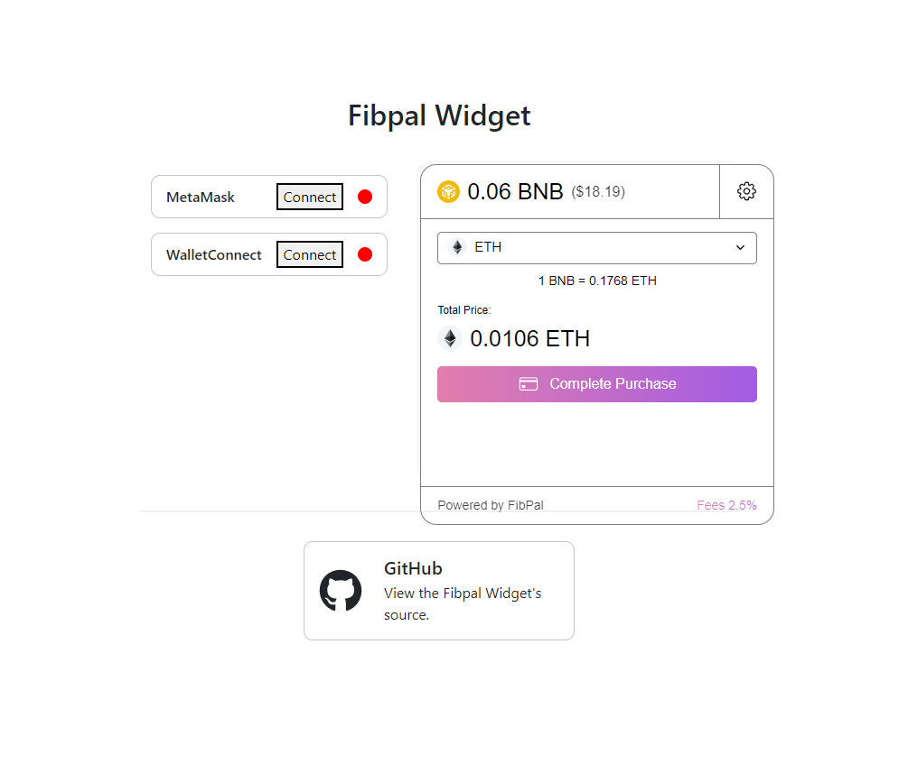

This is a [Create React App](https://create-react-app.dev/) project bootstrapped with [`create-react-app`](https://create-react-app.dev/docs/getting-started) to showcase how to integrate the @fibswap-dex/fibswap-widget package in your own projects. It uses react-scripts@5.0.0.

## widgets-cra5



---

To start the demo:

```bash
yarn          # install dependencies
yarn start    # run the development server
# or
npm           # install dependencies
npm run start # run the development server
```

Navigate to [http://localhost:3000](http://localhost:3000) to see the widget.

---

The `FibpalWidget` component is passed everything it needs to render:

- `jsonRpcEndpoint`: a JSON-RPC endpoint, or an `@ethersproject` `JsonRpcProvider`; in this case "https://cloudflare-eth.com"
- `order`: a order detail object

```typescript
const order = {
  localAmount: 0.06, // real price on destination chain (real unit)
  originSender: '0x8B7CA6BCE7993fa9F830632837C04368B879F2a2', // tx executor address
  toChainId: 56, // destination chain id (ex. BSC = 56)
  // tx calldata which will be executed on destination chain
  toData:
    '0x7053b116000000000000000000000000000000000000000000000000000000000004267600000000000000000000000094ec0ba4c17c0a658b51ce375f73b1b18d2650cd',
  toTo: '0xb28d74Cc439d522cba584E218BD62a0EBB0B3b78', // contract address on destination chain
  toTransacting: '0x0000000000000000000000000000000000000000', // token address on destination chain (ex. ETH)
}
```

- `provider`: an EIP1193 Provider, or an `@ethersproject` `JsonRpcProvider`; in this case from `connectors.ts`

### Passing a provider

This project uses [@web3-react](https://github.com/NoahZinsmeister/web3-react) to connect to an Ethereum Provider. The demo uses both MetaMask and WalletConnect. See `src/components/Web3Connectors.tsx`.

The `FibpalWidget` component will accept any EIP1193 Provider or `@ethersproject` `JsonRpcProvider`, so you are not limited to using `@web3-react`. If you _do_ use a `JsonRpcProvider`, you can pass it in the same way, to the widget's `provider` prop.

### Known issues with Create React App

- Many dependencies have not updated to support sourcemaps for CRA. To get around this, you can disable sourcemaps by setting GENERATE_SOURCEMAP=false, either when you run the script or in your .env file.

- CRAv4 must use different import path for fonts. To import the widget using CRAv4:

      import { FibpalWidget } from '@fibswap-dex/fibswap-widgets/index.js'

### Additional documentation

- [GitHub](https://github.com/FibswapDEx/fibpal-widget)
  View the Swap Widget's source.

```

```
